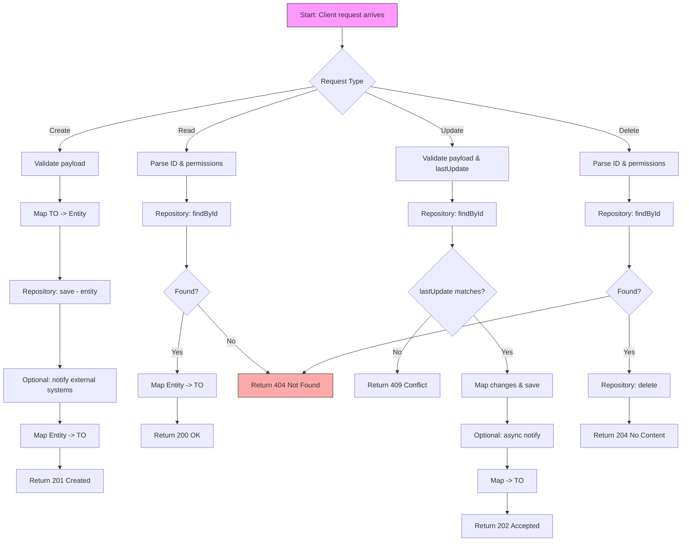

# Product Operations - Activity Diagram

This activity diagram outlines the higher-level flow for Product lifecycle operations, including validation, mapping, persistence, and notifications.

Notes and conventions

- Validation includes schema validation, business rules, and permission checks.
- All responses include project-specific headers when required (e.g., `DirectoryAppConstants.MESSAGE_HEADER`).
- External notifications (Backbone/Mercury) are optional and used for sync/async integration per service needs.

