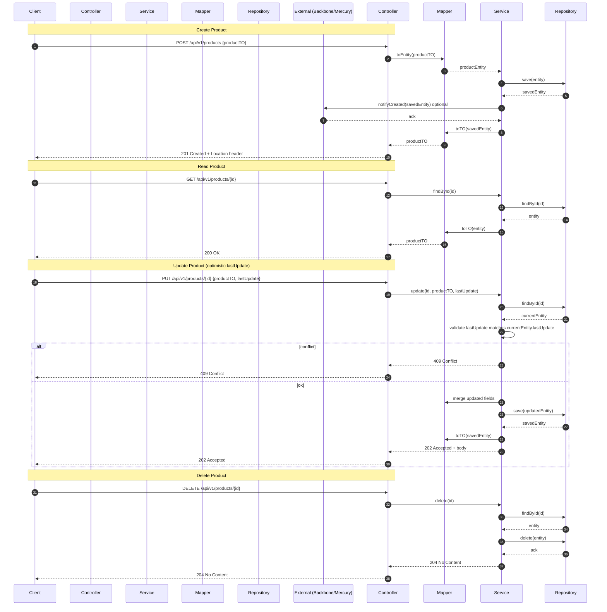

# Product Operations - Sequence Diagram

This sequence diagram describes the typical flow for Product operations (Create, Read, Update, Delete) in the `directory-backend` microservice. The API follows the `*Api.java` + `*Controller.java` pattern and goes controller -> service -> repository, with mapper conversions and external client calls when needed.

Notes

- The controller returns ResponseEntity with proper headers (e.g., `DirectoryAppConstants.MESSAGE_HEADER`) per project conventions.
- Update operations use optimistic-lock-style `lastUpdate` checks returning `202 Accepted` on success and `409 Conflict` on mismatch.
- Mappers are MapStruct-based and live in `src/main/java/com/prx/directory/mapper`.

